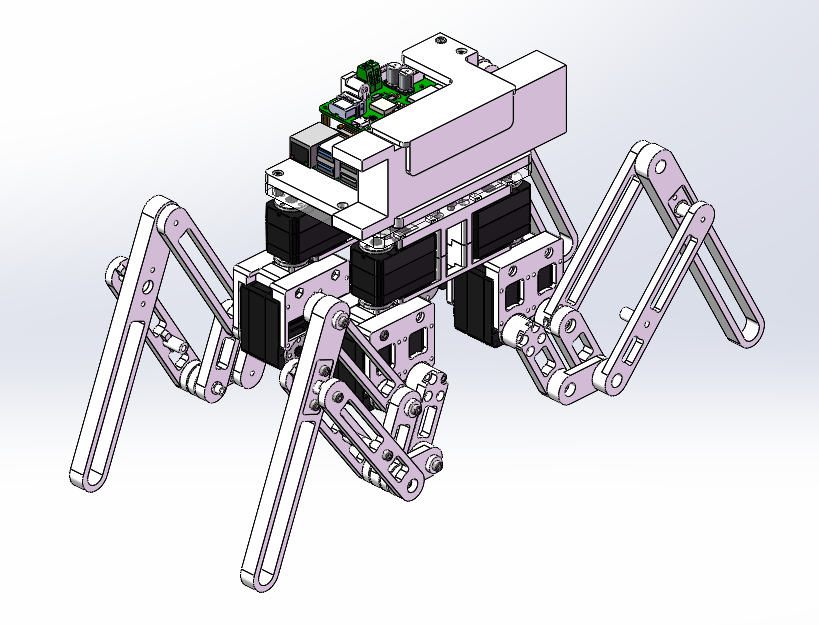
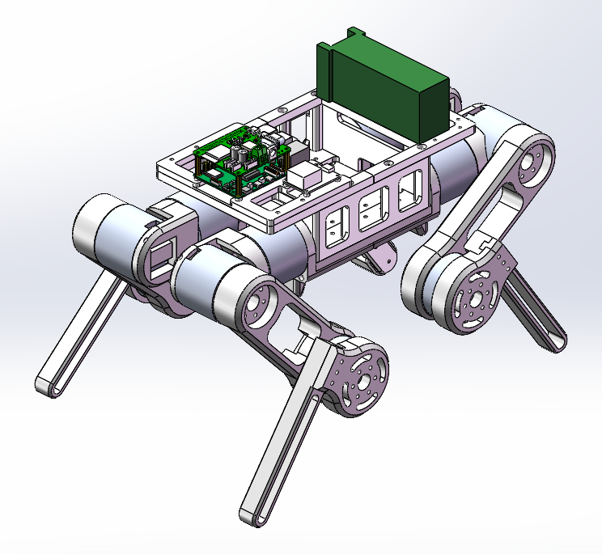
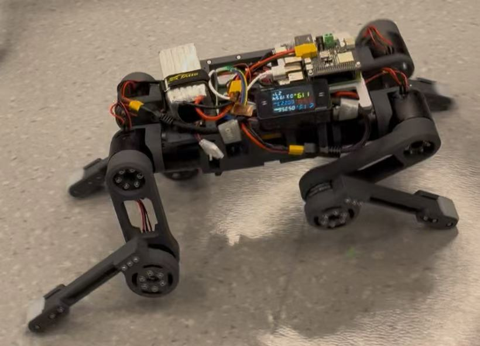

# MultiAxisSystem

- A collection of multi-DOF, modular legged robots for exploration and research.

- All files are open-source but not yet fully organized. Email me if you're highly interested and need them urgently.

